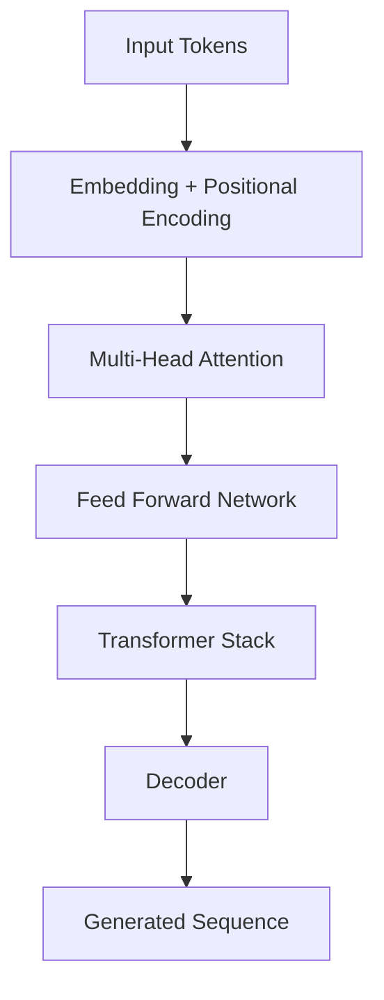

# Week 3 — Transformers and Vision Transformers

## Overview

This project focused on implementing transformer architectures from scratch and understanding the mechanics behind modern sequence modeling systems.

The work covered:
- multi-head attention,
- encoder-decoder transformers,
- autoregressive generation,
- and Vision Transformers (ViT).

Several experiments involved adapting transformer architectures to visual tasks and image-to-text generation.

---

# Main Objectives

- Implement attention mechanisms from scratch
- Build transformer encoder/decoder blocks
- Train autoregressive sequence models
- Implement Vision Transformers
- Explore image-to-text pipelines

---

# Transformer Architecture

---

# Core Components Implemented

## Multi-Head Attention

Implemented:
- query/key/value projections
- scaled dot-product attention
- masking
- residual connections
- layer normalization

## Transformer Blocks

Built:
- encoder layers
- decoder layers
- feed-forward blocks
- positional embeddings

## Vision Transformer (ViT)

Implemented:
- image patch extraction
- patch embeddings
- transformer-based image encoding

---

# Projects

## Image-to-Text System

Built a system capable of:
- processing images,
- encoding visual information,
- generating textual outputs autoregressively.

## Sequence Generation

Explored:
- next-token prediction
- teacher forcing
- decoding strategies

---

# Engineering Work

- PyTorch module design
- modular transformer implementations
- GPU training
- mixed precision experimentation
- debugging tensor shapes and attention masks

---

# Topics Explored

- attention mechanisms
- autoregressive decoding
- sequence modeling
- transformer scaling
- positional encoding
- multimodal extensions

---

# References

- Attention Is All You Need
- Vision Transformers (ViT)
- GPT
- BERT
