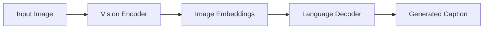

# Week 4 — Multimodal Learning and Image Captioning

## Overview

This project explored multimodal learning systems that combine vision and language representations.

The primary focus was image captioning using transformer-based encoder-decoder architectures and transfer learning from modern vision-language models.

---

# Main Objectives

- Build multimodal pipelines
- Combine visual and textual representations
- Train image captioning systems
- Explore CLIP-style embedding spaces
- Experiment with transfer learning

---

# Multimodal Pipeline

---

# Implemented Components

## Vision Encoder

Worked with:
- Vision Transformers (ViT)
- CLIP-style architectures
- patch embeddings
- visual feature extraction

## Decoder

Implemented transformer decoders for:
- caption generation
- autoregressive text generation
- conditional generation

## Dataset Processing

Built pipelines for:
- image preprocessing
- caption tokenization
- multimodal batching

---

# Datasets

## Flickr30k

Used for:
- image captioning
- multimodal alignment
- evaluation

---

# Topics Explored

- transfer learning
- multimodal embeddings
- contrastive learning
- encoder-decoder architectures
- image-text alignment

---

# Engineering Work

- GPU training
- experiment management
- multimodal batching
- inference pipelines
- deployment experiments

---

# Advanced Topics

Explored:
- CLIP
- PaliGemma
- ColPali
- multimodal retrieval
- reasoning traces

---

# References

- CLIP
- ViT
- Flickr30k
- PaliGemma
- ColPali
