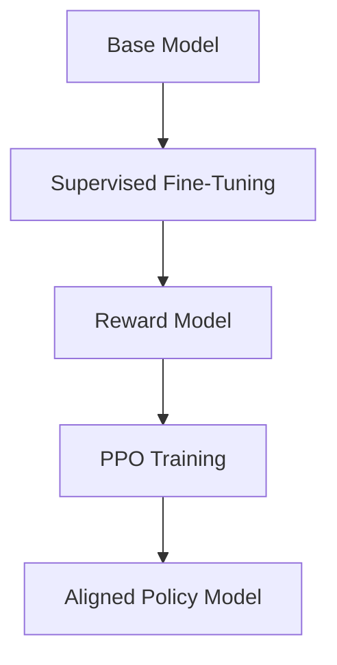

# Week 6 — RLHF, PPO, and Model Alignment

## Overview

This project explored modern techniques for aligning large language models with human preferences.

The work focused on:
- reward modeling,
- RLHF,
- PPO,
- preference optimization,
- and sparse Mixture of Experts architectures.

---

# Main Objectives

- Understand RLHF pipelines
- Train reward models
- Explore PPO optimization
- Study preference alignment
- Investigate Mixture of Experts architectures

---

# RLHF Pipeline

---

# Implemented Components

## Reward Modeling

Worked with:
- preference datasets
- scalar reward prediction
- ranking objectives

## PPO

Explored:
- policy optimization
- KL regularization
- clipped objectives
- stability constraints

## PEFT Integration

Combined:
- LoRA
- fine-tuning
- RLHF workflows

---

# Mixture of Experts (MoE)

Studied sparse transformer architectures:
- expert routing
- gating networks
- sparse activation
- Switch Transformers

---

# Topics Explored

- preference optimization
- policy learning
- alignment
- scaling laws
- sparse architectures
- reinforcement learning for LLMs

---

# Engineering Work

- training pipelines
- distributed experimentation
- GPU optimization
- experiment tracking

---

# References

- PPO
- RLHF
- InstructGPT
- Switch Transformers
- LoRA
